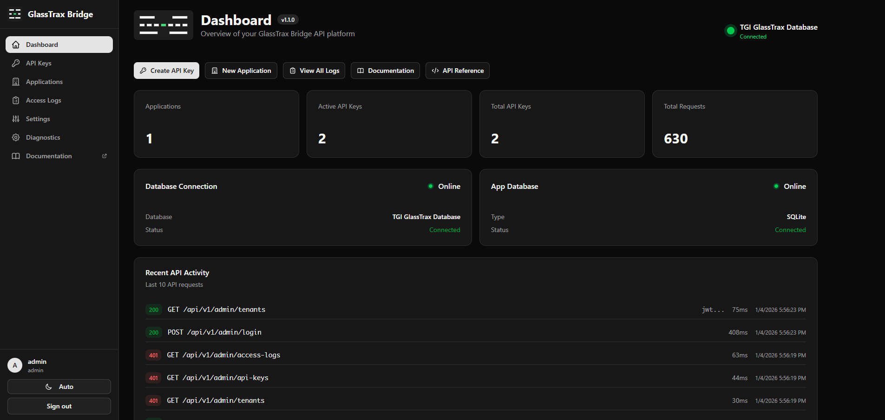

<p align="center">
  
</p>

<h1 align="center">GlassTrax Bridge</h1>

<p align="center">
A multi-tenant API platform for secure, read-only access to GlassTrax ERP data via Pervasive SQL.
</p>

<p align="center">
  <a href="https://github.com/Codename-11/GlassTrax-Bridge/actions"></a>
  <a href="https://github.com/Codename-11/GlassTrax-Bridge/releases"></a>
  <a href="https://ghcr.io/codename-11/glasstrax-bridge"></a>
  <a href="https://codename-11.github.io/GlassTrax-Bridge/"></a>
</p>

## Features

- **REST API Server** - FastAPI-based API with OpenAPI documentation
- **Admin Portal** - React web interface for managing API keys and tenants
- **Settings UI** - Edit `data/config.yaml` from the portal (preserves comments)
- **Multi-Tenant Architecture** - Isolate access by application/tenant
- **API Key Authentication** - Secure, hashed key storage with bcrypt
- **API Key Expiration** - Automatic enforcement of key expiration dates
- **Access Logging** - Full audit trail with filtering and CSV export
- **Database Migrations** - Alembic-managed schema versioning
- **Agent Mode** - Docker deployment with Windows ODBC agent
- **Dark Mode** - Light/dark/system theme support in portal
- **Read-Only Access** - Safe querying without data modification risk

<p align="center">
  
</p>

## Installation

### Option A: Docker + Windows Agent (Recommended)

Run Portal and API in Docker, with a Windows agent providing ODBC access. This is the recommended deployment method.

**Step 1:** Install the GlassTrax API Agent on Windows
- Download `GlassTraxAPIAgent-X.X.X-Setup.exe` from [Releases](https://github.com/Codename-11/GlassTrax-Bridge/releases)
- Run installer and start agent from system tray
- Save the API key shown on first run

**Step 2:** Configure environment
```bash
# Copy the example environment file
cp .env.example .env

# Edit with your settings
nano .env  # or use any text editor
```

Example `.env` file:
```env
AGENT_ENABLED=true
AGENT_URL=http://192.168.1.100:8001
AGENT_KEY=gta_your_key_here
```

**Step 3:** Start Docker
```bash
docker-compose up -d
```

**Step 4:** First-time setup
```bash
# View logs to get the auto-generated admin API key
docker logs glasstrax-bridge
```

Access at `http://localhost:3000`. Default login: `admin` / `admin` (change this immediately!).

### Option B: Docker Standalone

For testing without GlassTrax database access:

```bash
docker-compose up -d
```

Access at `http://localhost:3000`. No `.env` file needed for testing.

### Option C: Windows All-in-One (Beta)

Run everything directly on Windows with full GlassTrax ODBC access.

**Prerequisites:**
- Windows with Pervasive ODBC Client configured
- Python 3.11 32-bit (bundled in `python32/`)
- Node.js 18+

```powershell
# Clone and setup
git clone https://github.com/Codename-11/GlassTrax-Bridge.git
cd GlassTrax-Bridge

# Install Python dependencies
python32\python.exe -m pip install -r requirements.txt

# Initialize database
python32\python.exe -m alembic upgrade head

# Start production server
.\run_prod.bat
```

Access at `http://localhost:8000` (Portal and API on one port).

> **Note**: Config is auto-created at `data/config.yaml` on first run. Configure your DSN via the Settings page or edit the file directly.

### URLs by Deployment

| Deployment | Portal | API | Swagger | Docs |
|------------|--------|-----|---------|------|
| Docker + Agent | :3000 | :3000/api/v1 | :3000/api/docs | [GitHub Pages](https://codename-11.github.io/GlassTrax-Bridge/) |
| Windows | :8000 | :8000/api/v1 | :8000/api/docs | [GitHub Pages](https://codename-11.github.io/GlassTrax-Bridge/) |

## Development Setup

For local development with hot-reload:

### Prerequisites

- **Windows** (for GlassTrax ODBC access)
- **Node.js 18+**
- **Pervasive ODBC Client** configured

Python 3.11 32-bit is bundled in `python32/` - no separate installation needed.

### Quick Start

```powershell
# Clone and install dependencies
git clone https://github.com/Codename-11/GlassTrax-Bridge.git
cd GlassTrax-Bridge
python32\python.exe -m pip install -r requirements.txt
npm install

# Initialize database
python32\python.exe -m alembic upgrade head

# Start dev server with hot-reload
.\run_dev.bat
```

> Config is auto-created at `data/config.yaml` on first run. Edit via Settings page or directly.

Development server runs at `http://localhost:5173` with Vite proxying API requests. Documentation is available at [GitHub Pages](https://codename-11.github.io/GlassTrax-Bridge/).

## Authentication

### Admin Portal Login

> ⚠️ **Security Warning**: The default password is `admin`. Change it immediately after first login via the Settings page or by setting `password_hash` in `data/config.yaml`.

Two authentication methods are supported:

1. **Username/Password** - Default: `admin` / `admin`

   Change via Settings page in the portal, or set a bcrypt hash in `data/config.yaml`:
   ```yaml
   admin:
     username: "admin"
     password_hash: "$2b$12$..."  # bcrypt hash
   ```

   Generate a password hash:
   ```bash
   # Using Python (works on Windows with python32)
   python -c "import bcrypt; print(bcrypt.hashpw(b'YOUR_PASSWORD', bcrypt.gensalt()).decode())"

   # Or using Docker
   docker run --rm python:3.11-slim python -c "import bcrypt; print(bcrypt.hashpw(b'YOUR_PASSWORD', bcrypt.gensalt()).decode())"
   ```

2. **API Key** - Use any admin API key (starting with `gtb_`) as the password

### API Authentication

All API endpoints require an API key in the `X-API-Key` header:

```bash
curl -H "X-API-Key: gtb_your_key_here" http://localhost:8000/api/v1/customers
```

## API Endpoints

| Endpoint | Method | Description | Auth |
|----------|--------|-------------|------|
| `/health` | GET | Health check | None |
| `/api/v1/customers` | GET | List customers | API Key |
| `/api/v1/customers/{id}` | GET | Get customer | API Key |
| `/api/v1/orders` | GET | List orders | API Key |
| `/api/v1/orders/{id}` | GET | Get order | API Key |
| `/api/v1/admin/tenants` | GET/POST | Manage applications | Admin Key |
| `/api/v1/admin/api-keys` | GET/POST | Manage API keys | Admin Key |
| `/api/v1/admin/access-logs` | GET | View access logs | Admin Key |
| `/api/v1/admin/config` | GET/PATCH | View/update configuration | Admin Key |
| `/api/v1/admin/diagnostics` | GET | System diagnostics | Admin Key |
| `/api/v1/admin/login` | POST | Admin login (JWT) | None |

Full API documentation available at http://localhost:8000/api/docs

## Project Structure

```
GlassTrax-Bridge/
├── api/                      # FastAPI application
│   ├── main.py               # Application entry point
│   ├── config.py             # Settings management
│   ├── routers/              # API endpoints
│   ├── models/               # SQLAlchemy models
│   ├── schemas/              # Pydantic schemas
│   ├── services/             # GlassTrax data access
│   ├── middleware/           # Auth & request logging
│   └── utils/                # Shared utilities
├── agent/                    # GlassTrax API Agent (for Docker deployments)
│   ├── run_agent.bat         # Start agent manually
│   └── install_service.bat   # Install as Windows Service
├── portal/                   # React admin portal (Vite + shadcn)
│   └── src/
│       ├── components/       # UI components
│       ├── pages/            # Route pages
│       └── lib/              # API client, auth
├── docs/                     # VitePress user documentation
├── docs-internal/            # Internal developer docs
├── migrations/               # Alembic database migrations
│   ├── versions/             # Migration scripts
│   └── env.py                # Migration environment
├── docker/                   # Docker configuration
├── config.example.yaml       # Configuration template
├── agent_config.example.yaml # Agent configuration template
├── alembic.ini               # Alembic configuration
├── VERSION                   # Central version file
├── run_dev.bat               # One-click dev startup
├── run_prod.bat              # Windows production
└── requirements.txt          # Python dependencies
```

## Database Migrations

GlassTrax Bridge uses Alembic for database schema management.

```powershell
# Check current version
python32\python.exe -m alembic current

# Apply pending migrations
python32\python.exe -m alembic upgrade head

# Create new migration after model changes
python32\python.exe -m alembic revision --autogenerate -m "Description"

# Rollback one migration
python32\python.exe -m alembic downgrade -1
```

The API checks for pending migrations on startup and displays a warning if updates are needed.

## Production Deployment

### Docker + Windows Agent (Recommended)

Best option: Docker runs full API + portal, Windows runs minimal agent for ODBC access.

**Step 1: On Windows** - Install the GlassTrax API Agent:
- Download from [Releases](https://github.com/Codename-11/GlassTrax-Bridge/releases)
- Run installer and start from system tray
- Save the API key shown on first run

**Step 2: On Docker host** - Configure agent connection:
```bash
AGENT_ENABLED=true \
AGENT_URL=http://192.168.1.100:8001 \
AGENT_KEY=gta_your_key_here \
docker-compose up -d
```

Portal on `:3000` with full GlassTrax access via agent.

### Docker Standalone

```bash
docker-compose up -d
```

Portal on `:3000` (no GlassTrax ODBC access - for testing only)

### Windows All-in-One (Beta)

```powershell
.\run_prod.bat
```

Builds and serves everything on port 8000:
- Portal at `/`
- API at `/api/v1`
- Swagger at `/api/docs`
- Docs at [GitHub Pages](https://codename-11.github.io/GlassTrax-Bridge/)

### Agent Installer

For easier deployment, download the standalone Windows installer from [Releases](https://github.com/Codename-11/GlassTrax-Bridge/releases):

- Includes 32-bit Python runtime (no Python installation needed)
- System tray application with start/stop controls
- Optional auto-start on Windows boot

```powershell
# Or build the installer locally (requires Inno Setup 6)
.\build_agent.ps1
```

### Docker Images

Pull from GitHub Container Registry:

```bash
# Latest version
docker pull ghcr.io/codename-11/glasstrax-bridge:latest

# Specific version
docker pull ghcr.io/codename-11/glasstrax-bridge:1.0.0
```

## Versioning

Version is managed via the `VERSION` file in project root.

```powershell
# Update version
echo "1.1.0" > VERSION

# Sync to package.json files
cd portal && npm run sync-version
cd ../docs && npm run sync-version
```

## Development

See [docs-internal/DEVELOPMENT.md](docs-internal/DEVELOPMENT.md) for detailed local development guide.

### One-Click Development

```powershell
.\run_dev.bat
```

Starts all services in a single terminal with color-coded output.

## Documentation

- [Development Guide](docs-internal/DEVELOPMENT.md) - Local setup and workflows
- [API Reference](docs-internal/API.md) - REST API endpoints
- [Portal Guide](docs-internal/PORTAL.md) - Admin portal usage
- [Extending Guide](docs-internal/EXTENDING.md) - Adding endpoints and migrations
- VitePress Docs: Run `cd docs && npm run dev`

## Troubleshooting

| Issue | Solution |
|-------|----------|
| Driver not found | Install Pervasive ODBC client, verify with `pyodbc.drivers()` |
| Connection timeout | Increase `timeout` in `data/config.yaml` |
| API key invalid | Verify key is active and not expired |
| CORS errors | Check API server is running on expected port |
| Migration errors | Run `alembic upgrade head`, check `alembic current` |

## Security Notes

- **Change default password** - Set `password_hash` in `data/config.yaml` for production
- **Secure API keys** - Keys are shown only once when created
- **Key expiration** - Expired keys are automatically rejected
- **Read-only database** - All GlassTrax connections are read-only by design
- **Config files gitignored** - `data/config.yaml` and `agent_config.yaml` contain secrets

## Disclaimer

GlassTrax Bridge is an independent third-party tool. GlassTrax is a trademark of Kimzey Software Solutions. This product is not affiliated with, endorsed by, or sponsored by Kimzey Software Solutions.

## License

Copyright (c) 2025-2026 Axiom-Labs. All Rights Reserved.

This software is proprietary. Unauthorized copying, modification, or distribution is prohibited. See [LICENSE](LICENSE) for details.
